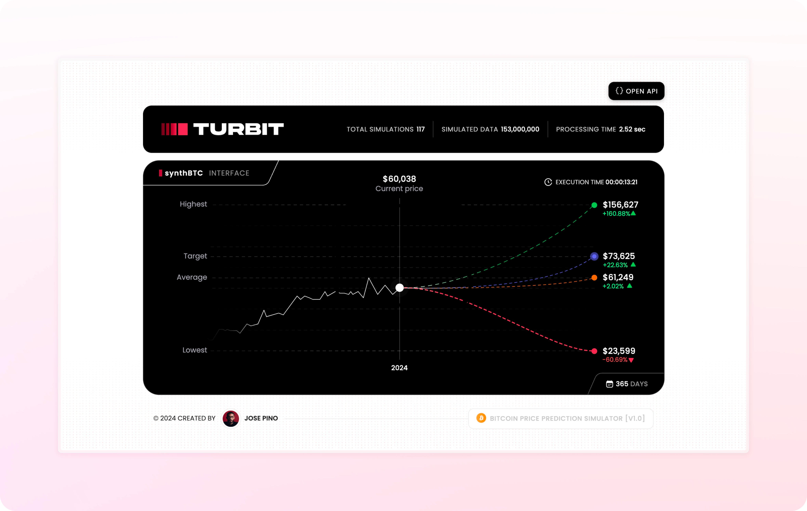

# synthBTC


## Bitcoin Price Prediction Simulator Using Synthetic Data

An advanced Bitcoin price prediction tool that utilizes Monte Carlo simulations and [Turbit](https://github.com/jofpin/turbit) parallel processing to create millions of potential price scenarios. synthBTC offers real-time market insights and synthetic data generation for comprehensive Bitcoin trend analysis and risk assessment.

> This is a tool for synthesizing Bitcoin data and generating synthetic data for testing and training purposes.

**Design Philosophy:** My primary goal with synthBTC has always been to make complex data easy to understand. I'm passionate about pure CSS and have focused my expertise on creating an intuitive, user-friendly interface. The UI includes subtle micro-interactions that I believe will delight fellow interface design enthusiasts. I've poured my love for clean, efficient design into every aspect of synthBTC to ensure that interpreting Bitcoin price predictions and simulation data is as straightforward as possible.



## Key Features

synthBTC excels in providing comprehensive Bitcoin price analysis and prediction:

| Feature | Description |
|---------|-------------|
| Monte Carlo Simulations | Generate thousands or millions of potential price scenarios |
| Real-time Data Integration | Fetch and incorporate live Bitcoin market data |
| Parallel Processing | Utilize Turbit for high-speed multicore computations |
| Customizable Parameters | Adjust volatility, time frames, and simulation counts |
| UI & Data Visualization | Intuitive web-based dashboard for visualizing predictions |
| API Integration | API for programmatic access to simulation results |
| Synthetic Data Generation | Create realistic Bitcoin price datasets for testing and training |

## Installation

To use synthBTC, ensure you have **[Node.js](https://nodejs.org/)** installed. Then, clone the repository and install dependencies:

```shell
git clone https://github.com/jofpin/synthBTC.git
cd synthBTC
npm install
```

## Usage

1. Run synthBTC with the following command:

```shell
node synthBTC.js
```

This command initializes the simulation engine, starts the web server, and makes the API available.

2. Access the intuitive dashboard by opening a web browser and navigating to:

```shell
http://localhost:1337
```

   The dashboard offers:
   - Real-time visualization of Bitcoin price predictions
   - Historical data charts
   - Customizable simulation parameters

3. Use the API endpoints:
   - **GET** `/api/overview`: Retrieve the most recent simulation data and key statistics
   - **GET** `/api/simulations`: Fetch a list of all historical simulation records
   - **GET** `/api/simulations/:id`: Get a specific simulation record by its unique identifier
   - **GET** `/api/simulations/:ids`: Retrieve multiple simulation records by their IDs (comma-separated)

## Configuration

The `config.json` file contains the configuration for the simulation and web server setup.

#### simulationConfig
- **turbitPower**: The number of cores to be used for simulations.
- **totalSimulations**: The number of simulations to be performed.
- **volatilityPercentage**: 20% volatility based on an average obtained from the `bitcoinAnalysis.js` file located in the `research-script` directory.
- **simulationDays**: The number of days to simulate.
- **simulationInterval**: How often (in minutes) a simulation is generated.

#### webConfig
- **serverPort**: The port to be used for the server.
- **homeEndpoint**: The route to be used for the main page.
- **htmlFilePath**: The name of the file to be used for the main page.

## Architecture

synthBTC utilizes a modular architecture leveraging Turbit for parallel processing:

1. **Data Fetching:** Real-time Bitcoin price data is retrieved using the [PriceFetcher](modules/priceFetcher.js) module.
2. **Monte Carlo Engine:** The [MonteCarloEngine](modules/monteCarloEngine.js) generates price scenarios using parallel processing.
3. **CSV Handling:** The [CSVHandler](modules/csvHandler.js) manages data input/output in CSV format.
4. **Server Core:** The [ServerCore](modules/serverCore.js) module orchestrates the entire simulation process.

## Synthetic Data Generation

synthBTC can generate synthetic Bitcoin price data for various purposes:

- Training machine learning models
- Testing trading algorithms
- Simulating market conditions

The generated data is saved in the `private/data` path, where the `core.csv` file contains the simulation overviews for each generated csv file.

## Research Script

The [`research-script`](research-script/) directory contains the Bitcoin Analysis Script ([`bitcoinAnalysis.js`](research-script/bitcoinAnalysis.js)). This script, developed prior to synthBTC, is the first of its kind to perform a comprehensive analysis of multiple Bitcoin factors in a single tool. It serves as a crucial component for synthBTC development and ongoing refinement, offering valuable insights into Bitcoin behavior and market trends.

> The script comprehensive analysis and modular structure provide a solid foundation for developers to create derivative tools and further innovate in Bitcoin price and market analysis.

Explore the script and its documentation in the [`research-script`](research-script/) directory.

## Powered by Turbit

synthBTC is powered by Turbit, an advanced high-speed multicore computing library designed for the multi-core era. Turbit optimizes performance for computationally intensive operations by leveraging parallel processing across multiple CPU cores.

---

For more information on Turbit, the parallel processing library powering synthBTC, visit the [repository](https://github.com/jofpin/turbit).

## License

The content of this project itself is licensed under the [Creative Commons Attribution 3.0 license](https://creativecommons.org/licenses/by/3.0/us/deed.en), and the underlying source code used to format and display that content is licensed under the [MIT license](LICENSE).

Copyright (c) 2024 by [**Jose Pino**](https://x.com/jofpin)
